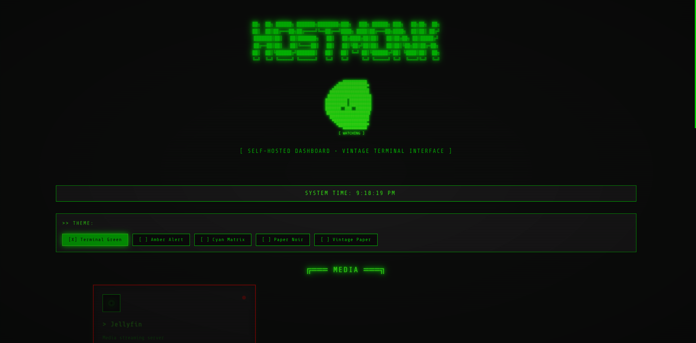

<div align="center">




A **vintage terminal-aesthetic dashboard** for self-hosted applications. Clean YAML configuration meets retro CRT computing vibes.

[](https://opensource.org/licenses/MIT)
[](https://nextjs.org/)
[](https://www.typescriptlang.org/)

</div>

---

## Features

- **5 Vintage Themes** - Terminal Green, Amber, Cyan, Paper Noir, Vintage Paper
- **Zero-Config Icons** - Just write "jellyfin" in your YAML and get the icon
- **Live Status Monitoring** - Real-time health checks with glowing indicators
- **Simple YAML Config** - No database, no complicated setup
- **50+ App Icons** - Pre-built SVG icons for popular self-hosted apps
- **CRT Effects** - Authentic scanlines, phosphor glow, and terminal aesthetics
- **Theme Hot-Swapping** - Change themes without page reload
- **Fully Responsive** - Mobile, tablet, and desktop support
- **Docker Ready** - One-command deployment
- **Keyboard Navigation** - Terminal-style shortcuts (coming soon)

---

##  Quick Start

### Using Docker (Recommended)

```bash
docker run -d \
  --name hostmonk \
  -p 3000:3000 \
  -v ./config:/app/config \
  hostmonk/hostmonk:latest
```

### Manual Setup

```bash
# Clone the repository
git clone https://github.com/yourusername/hostmonk.git
cd hostmonk

# Install dependencies
npm install

# Configure your services
cp config/examples/basic.yaml config/services.yaml
nano config/services.yaml

# Run development server
npm run dev

# Or build for production
npm run build
npm start
```

Visit `http://localhost:3000` and enjoy your vintage dashboard!

---

##  Configuration

Create a `config/services.yaml` file:

```yaml
version: "1.0"
theme: "terminal-green"

services:
  - name: "Jellyfin"
    icon: "jellyfin"          # Auto-maps to built-in icon
    url: "http://localhost:8096"
    description: "Media Server"
    category: "Media"
    ping: true               # Enable health check

  - name: "Portainer"
    icon: "portainer"
    url: "http://localhost:9000"
    description: "Docker Management"
    category: "Infrastructure"
```

That's it! No complicated JSON, no database migrations.

See `config/examples/` for more examples:
- `basic.yaml` - Minimal configuration
- `advanced.yaml` - Full-featured homelab setup
- `docker-labels.yaml` - Docker auto-discovery (planned feature)

---

##  Themes

HostMonk includes 5 carefully crafted vintage themes:

| Theme | Vibe | Use Case |
|-------|------|----------|
| **Terminal Green** | Classic CRT green phosphor | Default, authentic retro |
| **Amber** | IBM terminal orange glow | Warm vintage computing |
| **Cyan** | Blue-green cyberpunk | Modern retro fusion |
| **Paper Noir** | White on black | E-ink style, high contrast |
| **Vintage Paper** | Dark on cream | Old terminal printout |

All themes include:
- Animated scanlines
- CRT screen curvature simulation
- Phosphor glow effects
- Vignette darkening
- Authentic terminal fonts

---

## Supported Apps (50+ Icons)

### Media
Jellyfin • Plex • Emby • Navidrome

### *arr Suite
Sonarr • Radarr • Lidarr • Prowlarr • Bazarr • Readarr

### Downloads
qBittorrent • Transmission • Deluge • SABnzbd

### Infrastructure
Portainer • Traefik • Nginx • Caddy

### Monitoring
Grafana • Prometheus • Uptime Kuma • Netdata

### Network
Pi-hole • AdGuard Home • WireGuard • OpenVPN

### Storage
Nextcloud • Seafile • Syncthing • FileBrowser

### Home Automation
Home Assistant • Node-RED

### Security
Vaultwarden • Bitwarden

### Dashboards
Heimdall • Homer • Homarr

...and more!

**Don't see your app?** Adding icons is easy! See [CONTRIBUTING.md](CONTRIBUTING.md)

---

##  Architecture

HostMonk is built with:

- **Next.js 14** (App Router) - React framework with SSR
- **TypeScript** - Type-safe development
- **CSS Modules** - Scoped styling with vintage effects
- **js-yaml** - YAML configuration parsing
- **No Database** - Pure config file approach
- **Docker** - Production-ready containerization

See [TUTORIAL.md](docs/TUTORIAL.md) for a deep dive into the architecture and tech stack.

---

##  Docker Deployment

### Docker Compose

```yaml
version: '3.8'

services:
  hostmonk:
    image: hostmonk/hostmonk:latest
    container_name: hostmonk
    ports:
      - "3000:3000"
    volumes:
      - ./config:/app/config
    environment:
      - NODE_ENV=production
    restart: unless-stopped
```

### Environment Variables

| Variable | Default | Description |
|----------|---------|-------------|
| `NODE_ENV` | `development` | production or development |
| `PORT` | `3000` | Server port |
| `CONFIG_PATH` | `/app/config` | Config directory path |

---

##  Roadmap

- [x] Core dashboard functionality
- [x] YAML configuration
- [x] 5 vintage themes
- [x] 50+ app icons
- [x] Live status monitoring
- [ ] Docker label auto-discovery
- [ ] Keyboard shortcuts
- [ ] Custom icon upload
- [ ] Widget system (weather, system stats)
- [ ] Multi-user support
- [ ] API integration (actual service stats)
- [ ] Mobile app
- [ ] Theme editor

---

##  Contributing

We love contributions! HostMonk is built for the self-hosted community.

**Ways to contribute:**
-  Add new app icons
-  Create new themes
-  Report bugs
-  Suggest features
-  Improve documentation
-  Submit pull requests

See [CONTRIBUTING.md](CONTRIBUTING.md) for guidelines.

---

## 📖 Documentation

- [TUTORIAL.md](docs/TUTORIAL.md) - Architecture deep dive
- [THEMES.md](docs/THEMES.md) - Theme customization guide
- [ICONS.md](docs/ICONS.md) - Adding custom icons
- [CONFIG.md](docs/CONFIG.md) - Configuration reference

---

## 🙏 Acknowledgments

Inspired by:
- [homepage](https://github.com/gethomepage/homepage) - The OG self-hosted dashboard
- [Heimdall](https://github.com/linuxserver/Heimdall) - Classic dashboard design
- Vintage terminal aesthetics and retro computing
- The amazing self-hosted community

Special thanks to everyone running homelabs and keeping the self-hosted dream alive!

---

## 📜 License

MIT License - see [LICENSE](LICENSE) for details.

Built with ❤️ for the self-hosted community.

---

## 🌟 Star History

If you find HostMonk useful, consider giving it a star on GitHub!

**Questions?** Open an issue
**Ideas?** Start a discussion
**Want to chat?** Join our Discord (coming soon)

---

```
[ SYSTEM STATUS: ONLINE ]
[ MONITORING: ACTIVE ]
[ READY TO SERVE YOUR HOMELAB ]
```
